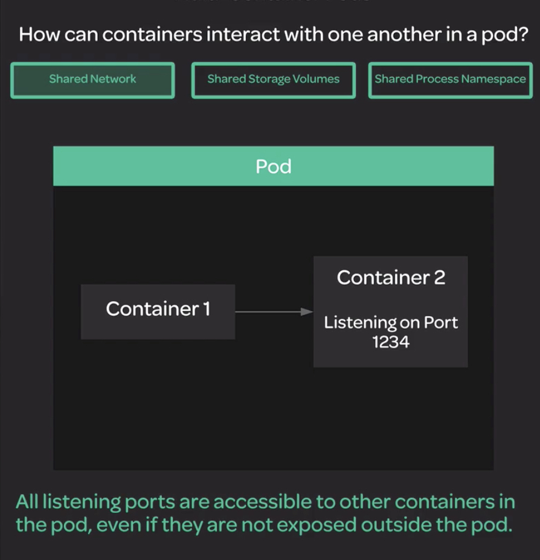
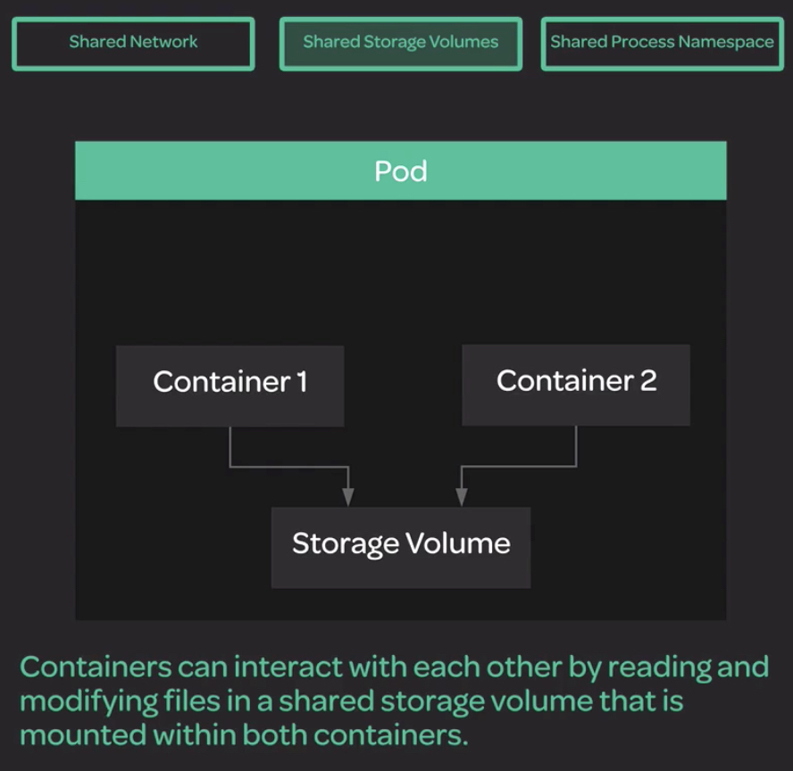
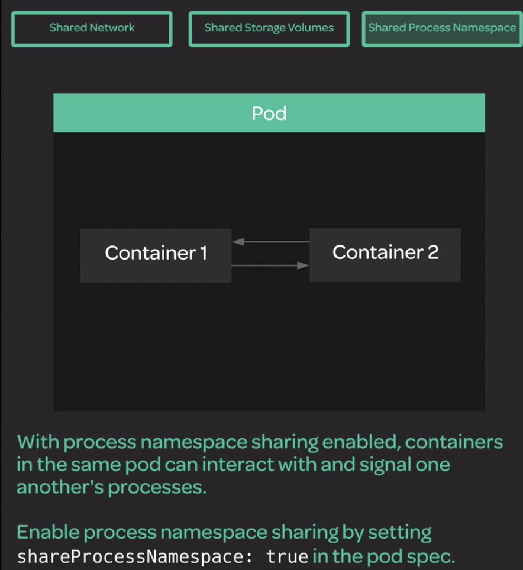
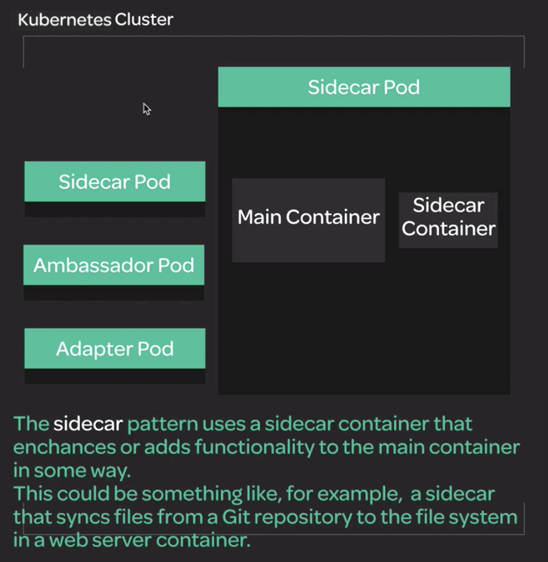
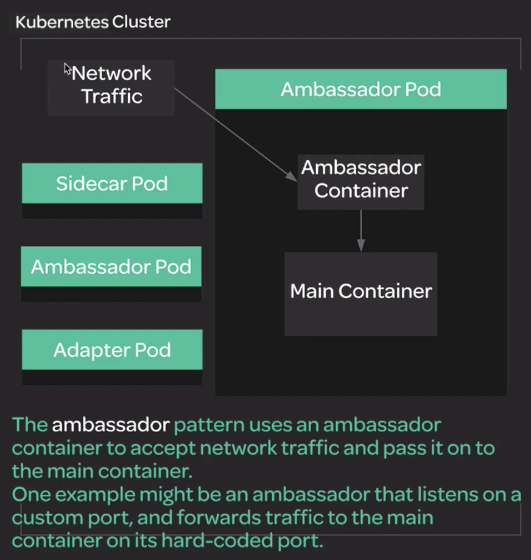
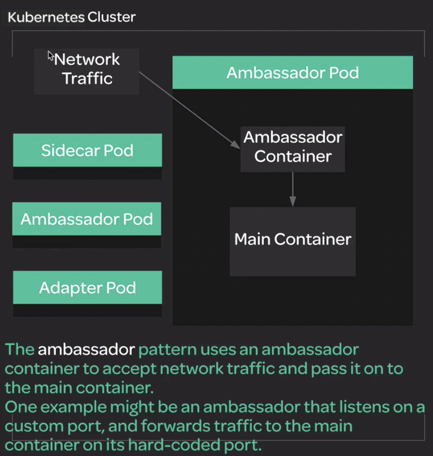

# Chapter 4

## Multi-container Pods

將多個 container 放置在同一個 Pod 內

### 3 purpose

- Shared Network

  

- Shared Storage Volumes
  
  

- Shared Process

  

### Multi-container Pods Design Pattern

#### Sidecar Pod

著重於有一個`主要(main)`的 Pod 與 `次要(sidecar)` 的 Pod 組合成一個完整功能



#### Ambassador Pod

著重於集中轉化/再處理 `input`



#### Adapter Pod

著重於轉化/再處理 `output`



---

## Lab

https://learn.acloud.guru/handson/01156e18-1509-42be-8975-998b3e461960/course/d068441f-75b4-4fe8-a7a6-df9153f24a35

### Introduction

Additional Resources

>Your supermarket company is in the process of moving their infrastructure to a Kubernetes platform in the cloud. This is sometimes challenging, because some of the older, legacy portions of that infrastructure have non-standard requirements. One of these legacy applications is a web service that provides a list of the various types of fruit the company sells in its stores.

>This service has already been packaged into a container image, but there is one special requirement: The legacy app is hard-coded to only serve content on port 8775, but the team wants to be able to access the service using the standard port 80. Your task is to build a Kubernetes pod that runs this legacy container and uses the ambassador design pattern to expose access to the service on port 80.

This setup will need to meet the following specifications:

- The pod should have the name `fruit-service`.
- The `fruit-service` pod should have a container that runs the legacy fruit service image: `linuxacademycontent/legacy-fruit-service:1`.
- The `fruit-service` pod should have an ambassador container that runs the `haproxy:1.7` image and proxies incoming traffic on port `80` to the legacy service on port `8775` (the HAProxy configuration for this is provided below).
- Port `80` should be exposed as a containerPort. Note that you do not need to expose port `8775`.
- The HAProxy configuration should be stored in a ConfigMap called `fruit-service-ambassador-config`.
- The HAProxy config should be provided to the ambassador container using a volume mount that places the data from the ConfigMap in a file at `/usr/local/etc/haproxy/haproxy.cfg`.
- `haproxy.cfg` should contain the following configuration data:
  
```cfg
global
    daemon
    maxconn 256

defaults
    mode http
    timeout connect 5000ms
    timeout client 50000ms
    timeout server 50000ms

listen http-in
    bind *:80
    server server1 127.0.0.1:8775 maxconn 32
```

Once your pod is up and running, it's a good idea to test it to make sure you can access the service from within the cluster using port 80. In order to do this, you can create a busybox pod in the cluster, and then run a command to attempt to access the service from within the busybox pod.

Create a descriptor for the busybox pod called `busybox.yml`.

```yml
apiVersion: v1
kind: Pod
metadata:
  name: busybox
spec:
  containers:
  - name: myapp-container
    image: radial/busyboxplus:curl
    command: ['sh', '-c', 'while true; do sleep 3600; done']
```

Create the busybox testing pod.

```sh
kubectl apply -f busybox.yml
```

Use this command to access `fruit-service` using port 80 from within the busybox pod.

```sh
kubectl exec busybox -- curl $(kubectl get pod fruit-service -o=custom-columns=IP:.status.podIP --no-headers):80
```

If the service is working, you should see some JSON listing various types of fruit.

### Practice

```sh
kubectl create namespace ch-4

```

### fruit-service-ambassador-config.yml

```yml
apiVersion: v1
kind: ConfigMap
metadata:
  name: fruit-service-ambassador-config
data:
  haproxy.cfg: |
    global
    daemon
    maxconn 256

    defaults
        mode http
        timeout connect 5000ms
        timeout client 50000ms
        timeout server 50000ms

    listen http-in
        bind *:80
        server server1 127.0.0.1:8775 maxconn 32
```

### fruit-service.yml

```yml
apiVersion: v1
kind: Pod
metadata:
  name: fruit-service
spec:
  containers:
    - name: legacy-fruit-service
      image: linuxacademycontent/legacy-fruit-service:1
    - name: fruit-service-ambassador
      image: haproxy:1.7
      volumeMounts:
        - name: fruit-service-volume
          mountPath: "/usr/local/etc/haproxy/"
      ports:
          - containerPort: 80
  volumes:
    - name: fruit-service-volume
      configMap:
        name: fruit-service-ambassador-config
```

---

## Reference

- [Logging Architecture](https://kubernetes.io/docs/concepts/cluster-administration/logging/#using-a-sidecar-container-with-the-logging-agent)
- [Communicate Between Containers in the Same Pod Using a Shared Volume](https://kubernetes.io/docs/tasks/access-application-cluster/communicate-containers-same-pod-shared-volume/)
- [The Distributed System ToolKit: Patterns for Composite Containers](https://kubernetes.io/blog/2015/06/the-distributed-system-toolkit-patterns/)