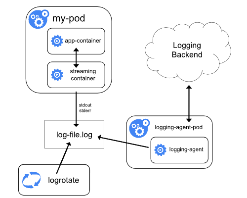

# Chapter 5 - Observability

## Liveness and Readiness Probes

https://learn.acloud.guru/course/d068441f-75b4-4fe8-a7a6-df9153f24a35/learn/e91d7010-d4e8-4d3c-8894-212900fd09bd/a116f79a-0f93-4fbe-b79f-c985c29541ff/watch

- Probes

  由於 k8s 會自動重啟你的 `pods`(預設)，所以有時候我們可以自定義決定 k8s 如何核定容器內的狀態(status). 可以用來決定何時準備好可運行第一個 `command` 或是準備接受第一個 `request`.

  3 type of handlers：

  - ExecAction:
  
    Executes a specified command inside the container. The diagnostic is considered successful if the command exits with a status code of 0.

  - TCPSocketAction:
  
    Performs a TCP check against the Pod's IP address on a specified port. The diagnostic is considered successful if the port is open.

  - HTTPGetAction:
  
    Performs an HTTP GET request against the Pod's IP address on a specified port and path. The diagnostic is considered successful if the response has a status code greater than or equal to 200 and less than 400.

  3 results :

  - Success: The container passed the diagnostic.
  - Failure: The container failed the diagnostic.
  - Unknown: The diagnostic failed, so no action should be taken.

- Liveness Probe

  Indicates whether the container is running properly, and governs when the cluster will automatically stop or restart the container.

  If the liveness probe fails, the kubelet kills the container, and the container is subjected to its `restart policy`. If a Container does not provide a liveness probe, the default state is Success.

- Readiness Probe

  Indicates whether the container is ready to service requests and governs whether requests will be forwarded to the pod.

  If the readiness probe fails, the endpoints controller removes the Pod's IP address from the endpoints of all Services that match the Pod. The default state of readiness before the initial delay is Failure. If a Container does not provide a readiness probe, the default state is Success.

- Startup Probe

  Indicates whether the application within the container is started. All other probes are disabled if a startup probe is provided, until it succeeds.

  If the startup probe fails, the kubelet kills the container, and the container is subjected to its `restart policy`. If a Container does not provide a startup probe, the default state is Success.

### When should you use

#### When should you use a liveness probe?

*FEATURE STATE: Kubernetes v1.0 [stable]*

If the process in your container is able to crash on its own whenever it encounters an issue or becomes unhealthy, you do not necessarily need a liveness probe; the kubelet will automatically perform the correct action in accordance with the Pod's restartPolicy.

If you'd like your container to be killed and restarted if a probe fails, then specify a liveness probe, and specify a restartPolicy of Always or OnFailure.

#### When should you use a readiness probe?

*FEATURE STATE: Kubernetes v1.0 [stable]*

If you'd like to start sending traffic to a Pod only when a probe succeeds, specify a readiness probe. In this case, the readiness probe might be the same as the liveness probe, but the existence of the readiness probe in the spec means that the Pod will start without receiving any traffic and only start receiving traffic after the probe starts succeeding. If your container needs to work on loading large data, configuration files, or migrations during startup, specify a readiness probe.

If you want your container to be able to take itself down for maintenance, you can specify a readiness probe that checks an endpoint specific to readiness that is different from the liveness probe.

#### When should you use a startup probe?

*FEATURE STATE: Kubernetes v1.20 [stable]*

Startup probes are useful for Pods that have containers that take a long time to come into service. Rather than set a long liveness interval, you can configure a separate configuration for probing the container as it starts up, allowing a time longer than the liveness interval would allow.

If your container usually starts in more than initialDelaySeconds + failureThreshold × periodSeconds, you should specify a startup probe that checks the same endpoint as the liveness probe. The default for periodSeconds is 10s. You should then set its failureThreshold high enough to allow the container to start, without changing the default values of the liveness probe. This helps to protect against deadlocks

### 參數

- initialDelaySeconds: 當啟動Liveness probe 或是 Readiness Probe 的條件準備好後, 要延遲多久才執行
- periodSeconds: 多久重新執行一次

*使用 startup probes 來保護啟動較慢的容器*

## References

- [Kubernetes — 健康檢查](https://medium.com/learn-or-die/kubernetes-%E5%81%A5%E5%BA%B7%E6%AA%A2%E6%9F%A5-59ee2a798115)
- [Container probes](https://kubernetes.io/docs/concepts/workloads/pods/pod-lifecycle/#container-probes)
- [Configure Liveness, Readiness and Startup Probes](https://kubernetes.io/docs/tasks/configure-pod-container/configure-liveness-readiness-startup-probes/)

---

## Container Logging

### Logs command

```sh
kubectl logs <pod name>
kubectl logs <pod name> -c <container name>
# Save log file
kubectl logs <pod name> > counter.log
```

### Logging at the node level


### Cluster-level logging architectures

Using a node logging agent:


Streaming sidecar container:



Sidecar container with a logging agent: 


## Reference

- [Logging Architecture](https://kubernetes.io/docs/concepts/cluster-administration/logging/)

---

## Installing Metrics Server

### Lesson Reference

Clone the metrics server repo and install the server using kubectl apply :

1. delete `metrics-server` deployment

  ```sh
  kubectl delete deployment metrics-server -n kube-system
  ```

2. apply remote latest `.yaml`

  ```sh
  kubectl apply -f https://github.com/kubernetes-sigs/metrics-server/releases/latest/download/components.yaml
  ```

Once you have installed the metrics server, you can use this command to verify that it is responsive:

```sh
kubectl get --raw /apis/metrics.k8s.io/
kubectl top nodes
```

---

## Monitoring Applications

`kubectl top` to gather information about resource usage(CPU, Memory) within the cluster.

```sh
kubectl top nodes
kubectl top pods
```

## Reference

- [Tools for Monitoring Resources](https://kubernetes.io/docs/tasks/debug-application-cluster/resource-usage-monitoring/)

---

## Debugging

1. Find the problem

  ```sh
  # Check all namespaces
  kubectl get  pods --all-namespaces
  # Get information
  kubectl describe <object type> <object name>
  # Only one container
  kubectl logs <pod name> -c <container name>
  ```

2. Fix the problem

  ```sh
  kubectl edit <object type> <object name>
  # 加上 --export 就不會帶出 status，只會給出當下的建立規格，易於重複建立使用
  kubectl get <object type> <object name> -o yaml --export
  kubectl apply -f <file name>
  ```

*不是所有 Object 都能 edit, 有些時候必須 delete 後 re-create.*

## Reference

- [Troubleshoot Applications](https://kubernetes.io/docs/tasks/debug-application-cluster/debug-application/)
- [Debug Pods and ReplicationControllers](https://kubernetes.io/docs/tasks/debug-application-cluster/debug-pod-replication-controller/)
- [Debug Services](https://kubernetes.io/docs/tasks/debug-application-cluster/debug-service/)

---

## Lab
