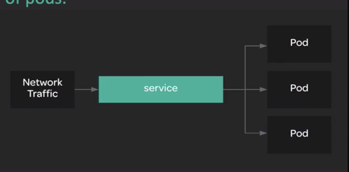

# Service and Networking

## Service

`Service` create an abstraction layer which provides network access to a dynamic set of pods.

Most services use `Selector` to determine which pods will receive traffic through the service.

---

## Networking